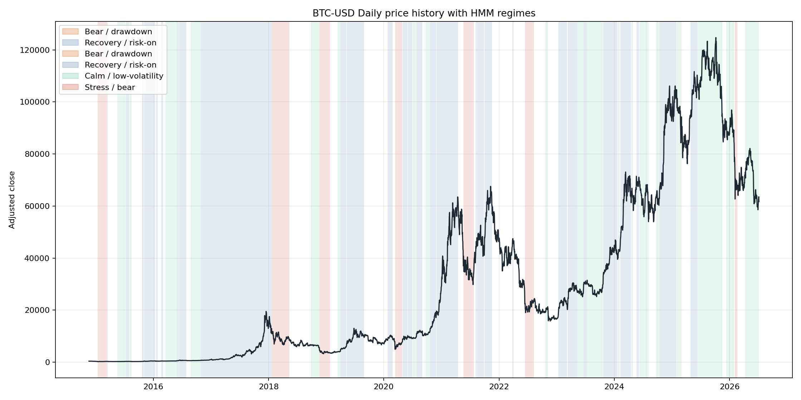
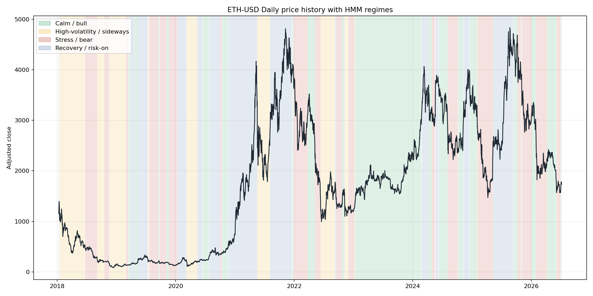
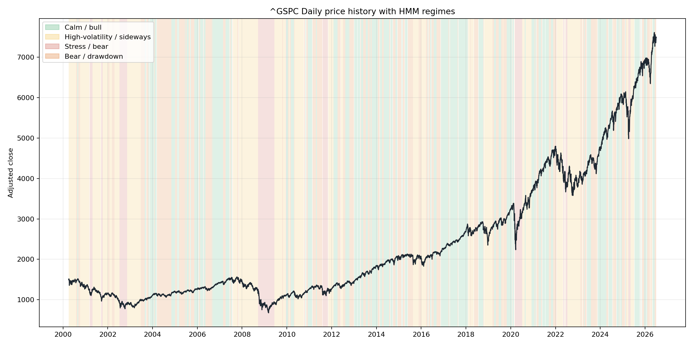
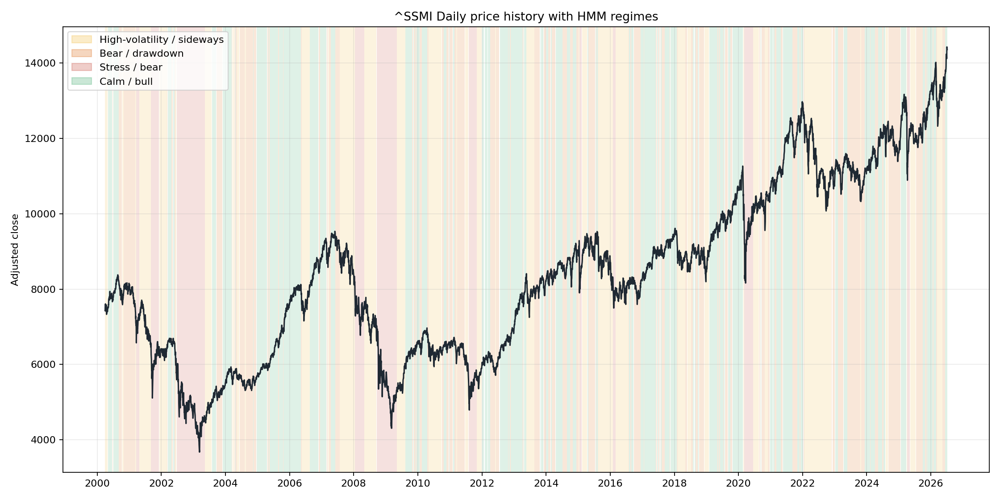
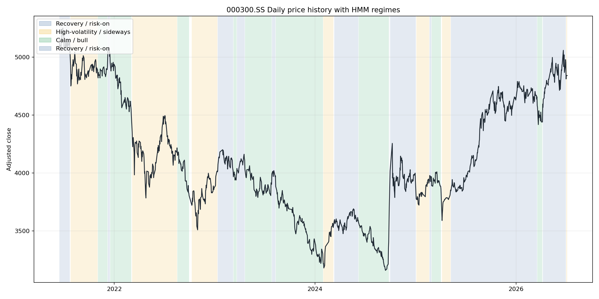
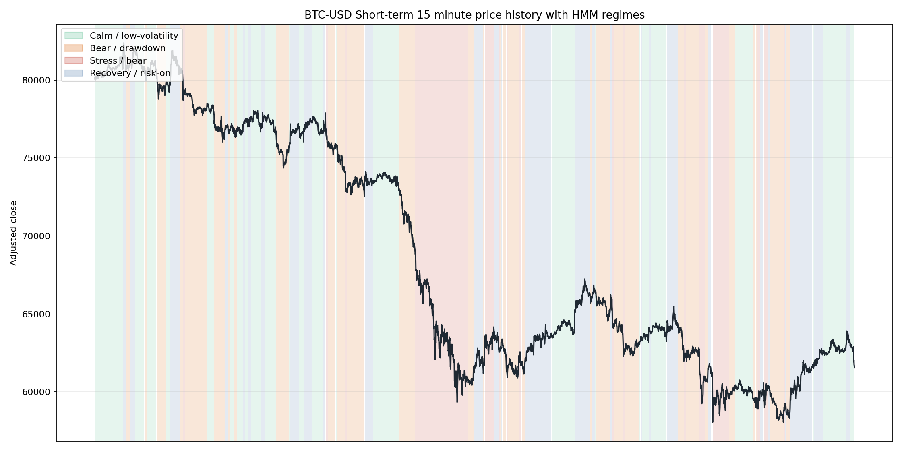

# Market Regime Detector Dashboard

Portfolio-quality quantitative finance project for detecting market regimes across equities,
crypto, and regional benchmarks with a Gaussian Hidden Markov Model.

**Suggested repo description:** Multi-asset market-regime dashboard for BTC, ETH, global equities, Switzerland, and China using rolling time-series features and Hidden Markov Models.

## What This Project Shows

Markets do not behave the same way all the time. A calm bull market, a drawdown, a crash,
and a volatile sideways period have different risk and return profiles. This project
learns those environments from price data without manually labeling dates.

It is designed for two audiences:

- **Non-quants:** clear regime names, shaded price charts, and plain-language explanations.
- **Quants / technical reviewers:** reproducible feature engineering, HMM model selection,
  transition probabilities, and statistical regime summaries.

## Scope

The dashboard supports:

- **Crypto:** Bitcoin (`BTC-USD`), Ethereum (`ETH-USD`)
- **Global / US market:** S&P 500 (`^GSPC`), Nasdaq Composite (`^IXIC`), MSCI ACWI ETF proxy (`ACWI`)
- **Europe:** Euro Stoxx 50 (`^STOXX50E`)
- **Switzerland:** Swiss Market Index (`^SSMI`), Swiss Performance Index (`CHSPI.SW`)
- **China:** CSI 300 (`000300.SS`), Shanghai Composite (`000001.SS`), Hang Seng (`^HSI`)
- **Custom tickers:** any Yahoo Finance ticker entered in the dashboard

Supported timeframes:

| Timeframe | Yahoo interval | Typical use |
| --- | --- | --- |
| 15 minute | `15m` | Short-term / tactical crypto and liquid markets |
| 1 hour | `1h` | Short-term regime monitoring |
| Daily | `1d` | Main strategic regime view |
| Weekly | `1wk` | Medium-term regime view |
| Monthly | `1mo` | Long-term cycle view |

Yahoo Finance limits how much intraday history is available. The pipeline therefore uses
recent rolling periods for intraday data and longer start dates for daily/weekly/monthly data.

## Model Choices

- **Language:** Python, because the finance, ML, and plotting ecosystem is mature.
- **Data source:** `yfinance`, using adjusted close prices where available.
- **Features:** rolling return, realized volatility, momentum, and drawdown.
- **Model:** Gaussian Hidden Markov Model, because it estimates both hidden states and
  transition probabilities between them.
- **Model selection:** BIC over 2 to 4 states by default. The upper bound is intentional:
  more states can fit the past better but often become harder to explain.
- **Dashboard:** Streamlit, because it keeps the project simple, local, and recruiter-friendly.

## Feature Engineering

The HMM is fitted on rolling features:

- **Rolling return:** recent direction.
- **Short realized volatility:** current risk.
- **Medium realized volatility:** broader risk environment.
- **Momentum:** medium-term trend.
- **Drawdown:** distance from the recent rolling high.

Feature windows adapt to the timeframe. For example, daily uses 21/63/126 bars, while
hourly and 15-minute views use shorter bar-based windows. Daily log return is still
computed, but mainly for regime statistics rather than direct state fitting.

## Quickstart

```powershell
cd "C:\Users\tukib\OneDrive - bbw.ch\Claude\Quantprojekte\market_regime_detector"
python -m pip install -r requirements.txt
python -m pip install -e .
```

Run the dashboard:

```powershell
market-regimes-dashboard
```

Or run a single pipeline from the command line:

```powershell
market-regimes --ticker BTC-USD --timeframe 1d --project-root .
market-regimes --ticker ETH-USD --timeframe 1h --project-root .
market-regimes --ticker ^SSMI --timeframe 1d --project-root .
market-regimes --ticker 000300.SS --timeframe 1d --project-root .
```

## Dashboard

The Streamlit dashboard has two views:

- **Single analysis:** choose one market and timeframe, then inspect the shaded price chart,
  regime stats, transition matrix, model-selection table, and regime-conditional strategy diagnostic.
- **Multi-asset snapshot:** run a compact scan across selected assets and timeframes to compare
  current detected regimes.

## Example Outputs

The repo includes generated examples under `reports/`.

### BTC Daily



### ETH Daily



### S&P 500 Daily



### Swiss Market Index Daily



### China CSI 300 Daily



### BTC Short-Term 15 Minute



## Strategy Diagnostic

The project includes a simple trend-following diagnostic:

- Long the asset when yesterday's close is above its moving average.
- Otherwise hold cash.
- Compare conditional performance by detected regime.

This is not meant as a production trading strategy. It is a diagnostic question:
does the same rule behave differently in different regimes?

## Look-Ahead Bias And Limitations

The default pipeline fits the model on the full selected sample and then labels that same
sample. That is useful for historical explanation, but it is **not** a live trading signal.
A live version should use expanding-window or walk-forward fitting, so each regime label is
based only on information available at that time.

Other limitations:

- Regime names are economic interpretations of statistical states, not objective truth.
- Intraday annualized statistics can look extreme, especially for crypto, because tiny bar
  returns are compounded over many periods per year.
- Yahoo Finance intraday availability is limited and ticker-dependent.
- HMM results can change with the feature set, state range, random seed, and sample period.
- The strategy diagnostic ignores fees, slippage, spreads, taxes, cash returns, and execution risk.

## Repo / GitHub

The local project now lives here:

```text
C:\Users\tukib\OneDrive - bbw.ch\Claude\Quantprojekte\market_regime_detector
```

The intended GitHub target can be:

```text
https://github.com/danizh910/market_regime_detector.git
```

If that remote is empty and you have push access:

```powershell
git remote add origin https://github.com/danizh910/market_regime_detector.git
git add .
git commit -m "Build multi-asset market regime dashboard"
git push -u origin main
```

## Tests

```powershell
pytest
ruff check .
```

## Educational Disclaimer

This repository is for education and portfolio demonstration only. It is not financial
advice, investment research, or a recommendation to buy or sell any security.
